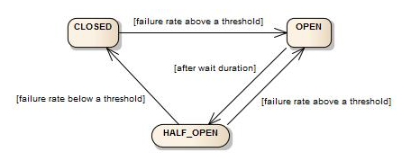

# CircuitBreaker

## CircuitBreaker 패턴이란?

- 원격 서버가 다운된 경우, 해당 서버를 의존하는 다른 서버들에 연쇄적으로 영향을 미치는 것을 방지하는 패턴이다.
- 원격 접속의 성공/실패를 집계하여 failure rate가 임계치를 넘어섰을 때 자동으로 접속을 차단하는 것이다.

## **성공/실패 카운트 방법**

### Count-based

- 마지막에 호출한 N번의 결과를 집계한다.

### Time-based

- 마지막 N초 동안의 호출 결과를 집계한다.

## C**ircuitBreaker의 상태**

- **closed:** 초기상태
- **open:** failure rate가 임계치를 넘어선 경우, 모든 접속이 차단됨
  - 이때 서버에 요청하면 에러 메세지를 날리는데, fallback을 이용해서 에러를 처리할 수 있음
- **half_open:** open 상태에서 일정 시간이 지난 상태, 접속을 시도하여 성공하면 closed, 실패하면 open 상태로 되돌아감

> **fallback:** open 상태에서 요청이 들어온 경우, 조금 더 의미있는 에러 메세지를 전달하거나, 미리 캐싱되거나 지정된 응답을 전달하는 것

## **Resilience4j**

- **Resilience4j** 라이브러리는 원격 접속에 대해 시스템이 다운되지 않도록 관리하여, 가용성 높은 시스템을 구축하도록 도와준다.
- **Resilience4j**는 Hystrix에서 영감을 얻었지만, 훨씬 편리한 API와 너무 잦은 요청 차단 (Rate Limiter), 동시에 많은 요청을 회피 (Bulkhead)와 같은 여러 기능을
  제공한다.

## **Resilience4j의 CircuitBreaker 설정**

- **Resilience4j**는 커스텀 Cirtcuit Breaker 설정을 위해 property들을 제공한다.

| Property                                     | Default Value | Description                                                                                                                                                                                                                                                                      |
| -------------------------------------------- | ------------- | -------------------------------------------------------------------------------------------------------------------------------------------------------------------------------------------------------------------------------------------------------------------------------- |
| failureRateThreshold                         | 50            | failure rate 임계치를 설정한다. failure rate가 임계치 이상인 경우, 상태를 open으로 변경한다.                                                                                                                                                                                     |
| slowCallDurationThreshold                    | 60000 [ms]    | slow call의 기준을 설정한다.                                                                                                                                                                                                                                                     |
| slowCallRateThreshold                        | 100           | slow call rate 임계치를 설정한다. slow call 의 기준은 slowCallDurationThreshold 이다. slow call rate가 임계치 이상인 경우, 상태를 open으로 변경한다.                                                                                                                             |
| permittedNumberOfCallsInHalfOpenState        | 10            | half open 상태일 때, 허가되는 요청 수를 설정한다.                                                                                                                                                                                                                                |
| maxWaitDurationInHalfOpenState               | 0 [ms]        | CircuitBreaker가 half open 상태로 유지될 수 있는 최대 대기 시간을 설정한다. 0은 half open 상태에서 허가된 모든 요청이 완료될 때까지 무한히 대기함을 의미한다.                                                                                                                    |
| slidingWindowSize                            | 100           | sliding window의 크기를 설정한다.                                                                                                                                                                                                                                                |
| slidingWindowType                            | COUNT_BASED   | 요청 결과를 기록하는 sliding window의 유형을 설정한다. COUNT_BASED: 마지막에 호출한 N번의 결과를 집계한다. TIME_BASE: 마지막 N초 동안의 호출 결과를 집계한다. N은 slidingWindowSize로 설정한다.                                                                                  |
| minimumNumberOfCalls                         | 100           | CircuitBreaker가 failure rate 또는 slow call rate를 구하기 위한 최소 요청 수를 설정한다. 10으로 설정시, 9개 요청이 모두 실패하더라도 open 상태로 전환되지 않는다.                                                                                                                |
| waitDurationInOpenState                      | 60000 [ms]    | open 상태에서 half open 상태로 전환하기까지 필요한 대기시간을 설정한다.                                                                                                                                                                                                          |
| automaticTransitionFromOpenToHalfOpenEnabled | false         | true로 설정되면 자동으로 상태가 open에서 half open으로 전횐된다. 스레드는 waitDurationOpenState를 통과하는지 모니터링한다. false로 설정되면 waitDurationOpenState를 통과해도, 요청이 이루어진 경우에만 전환이 일어난다. false의 장점은 스레드가 모니터링을 하지 않는다는 것이다. |
| ignoreExceptions                             | empty         | 목록으로 지정하는 예외들은 성공 또는 실패로 기록되지 않는다.                                                                                                                                                                                                                     |
| recordExceptions                             | empty         | 실패로 기록되어서 failure rate가 증가하는 예외 목록이다. ignoreExceptions에 명시되지 않는 한, 목록에서 상속되거나 일치하는 모든 예외는 실패로 기록된다. 예외 목록을 지정하면, 목록 외의 예외들은 성공으로 기록된다.                                                              |
